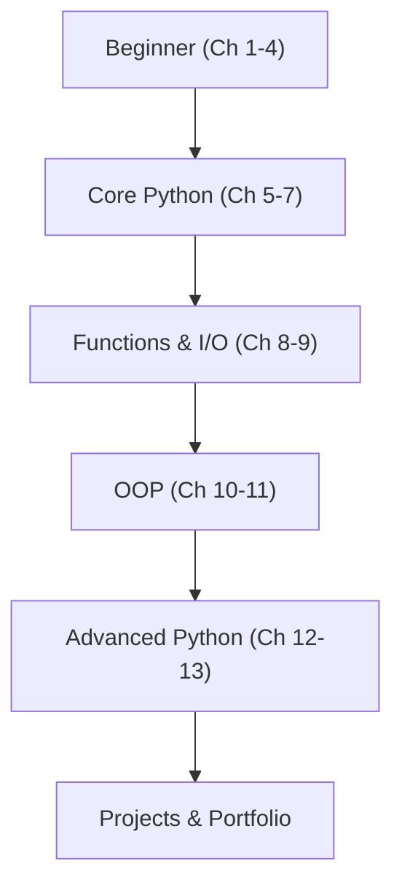

# 🐍 Python Learning Journey

---

Welcome to my personal coding space tracking my Python learning journey! This repository documents my progression from a absolute beginner to writing complex applications and automation tools.

## 📖 About the Handbook
I am following the structured roadmap of **"The Ultimate Python Programming Handbook"** as my primary source of truth for topics, practice problems, and projects.

---

## 📚 Learning Progress

Below is my progress through the 13 core chapters of the handbook:

| Chapter | Title |
| :--- | :--- |
| **01** | [Modules, Comments & pip](./Chapter-01-Modules-Comments-Pip) |
| **02** | [Variables & Datatypes](./Chapter-02-Variables-Datatypes) |
| **03** | [Strings](./Chapter-03-Strings) |
| **04** | [Lists & Tuples](./Chapter-04-Lists-Tuples) |
| **05** | [Dictionaries & Sets](./Chapter-05-Dictionaries-Sets) |
| **06** | [Conditional Expressions](./Chapter-06-Conditional-Expressions) |
| **07** | [Loops](./Chapter-07-Loops) |
| **08** | [Functions & Recursion](./Chapter-08-Functions-Recursion) |
| **09** | [File I/O](./Chapter-09-File-IO) |
| **10** | [Object Oriented Programming](./Chapter-10-OOP) |
| **11** | [Inheritance & OOP](./Chapter-11-Inheritance-OOP) |
| **12** | [Advanced Python 1](./Chapter-12-Advanced-Python-1) |
| **13** | [Advanced Python 2](./Chapter-13-Advanced-Python-2) |

---

## 🚀 Current Focus
### 🟡 Chapter 1: Modules, Comments & pip
- [x] **Printing Twinkle Twinkle Little Star** — Basic string printing and formatted text output.
- [~] **Using Python REPL** — Interactive console experimentation (learning REPL usage).
- [x] **Using an external module** — Text-to-speech rendering using `pyttsx3` and jokes via `pyjokes`.
- [x] **Using the `os` module** — Inspecting local files and printing directory structures.

*Note: Future exercises and practice files will be added systematically as I complete them.*

---

## 🗺️ Learning Roadmap

Here is the master plan of topics covered across the curriculum:

### 1️⃣ Python Fundamentals
* **Modules**: Built-in modules, External modules, `pip` package manager
* **Variables & Datatypes**: Identifiers, Data Types, Operators (Arithmetic, Assignment, Comparison, Logical), Input function, Typecasting
* **Strings**: Slicing, Slicing with skip value, String methods, Escape characters
* **Lists & Tuples**: List indexing, List methods, Tuples, Tuple methods
* **Dictionaries & Sets**: Dictionary properties and methods, Set properties, Set operations

### 2️⃣ Control Flow
* **Conditional Expressions**: `if-elif-else` constructs, Relational & Logical operators
* **Loops**: `while` loops, `for` loops, `range()` function, Loop control (`break`, `continue`, `pass`), For-Else blocks

### 3️⃣ Functions & File Handling
* **Functions & Recursion**: Function definitions and calls, Arguments, Default parameters, Recursive functions
* **File I/O**: File modes, Opening files, Reading/Writing files, `with` statements

### 4️⃣ Object-Oriented Programming (OOP)
* **OOP Core**: Classes, Objects, Instance vs Class attributes, `self` parameter, `@staticmethod`, Constructors (`__init__`)
* **Advanced OOP**: Single/Multiple/Multilevel Inheritance, `super()`, `@classmethod`, `@property` (Getters & Setters), Operator Overloading

### 5️⃣ Advanced Python
* **Advanced Features 1**: Walrus operator, Type hints, Match case, Dictionary merge/update, Exception handling (`try-except-else-finally`, `raise`), `__name__ == "__main__"`, `global` keyword, `enumerate()`, List comprehensions
* **Advanced Features 2**: Virtual environments (`venv`), `pip freeze`, Lambda functions, String `join()`/`format()`, Functional tools (`map()`, `filter()`, `reduce()`)

---

## 🛠️ Projects
As I progress, I will build the following projects outlined in the handbook:

| Project | Description | Folder |
| :--- | :--- | :--- |
| **Project 1: Snake, Water, Gun** | A classic text-based player vs computer game. | [`Projects/Snake-Water-Gun`](./Projects/Snake-Water-Gun) |
| **Project 2: The Perfect Guess** | A number guessing game tracking minimum attempts. | [`Projects/Perfect-Guess`](./Projects/Perfect-Guess) |
| **Mega Project 1: Jarvis** | A voice assistant leveraging speech recognition. | [`Projects/Jarvis`](./Projects/Jarvis) |
| **Mega Project 2: Auto Reply AI** | A smart auto-responder chatbot using AI. | [`Projects/Auto-Reply-AI-Chatbot`](./Projects/Auto-Reply-AI-Chatbot) |

---

## 📈 Learning Philosophy
> This repository documents my actual learning process. Code may start simple and improve over time. The goal is consistency, understanding, practice, and gradual improvement rather than writing perfect code from day one.
>
> *"Success is the sum of small efforts, repeated day-in and day-out."*
